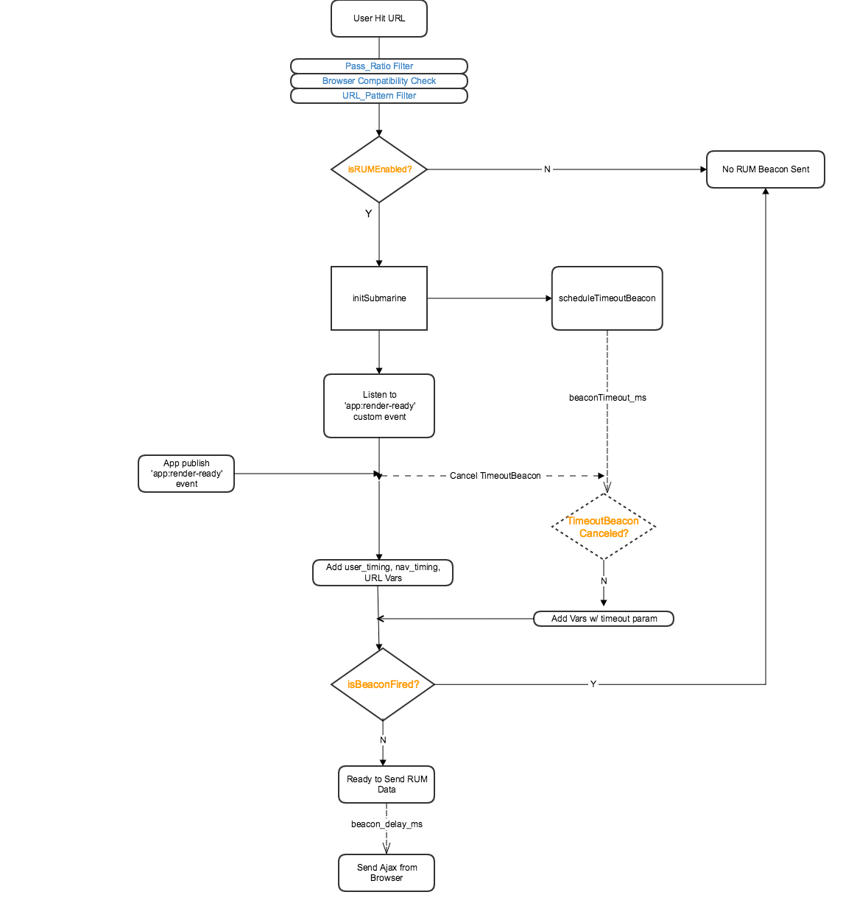

# Rummikub

### A brief intro
 Let Data Speak! The real user performance data like user-perceived page load time becomes more important because of the rapid growth of SPA. The traditional events provided by browsers are no longer that helpful to measure real user experience accurately. Combining with WebPageTest tool which is a synthetic way of page performance measurement, those can help web engineers drill down the page performance problem and make optimizations based on sufficient data.  

### Workflow Chart
   

### Usage
* **Customized Configurations:**  
**passRatio**:  Enable(>0) or disable(=0) RUM feature, throttling the total beacon samples by setting [0,1];  
**beacon_url**: The URL Path where the RUM beacon goes to;  
**url_pattern**: Regex supported, Only matched URLs will be tracked, or you can set to 'ALL' matching all URLs;  
**beacon_delay_ms**: How many ms delayed to send the beacon out from 'app:user-ready' event published;  
**beaconTimeout_ms**: Beacon will be forced sent out after this threshold, with 'timeout' in beacon parameters.  

* **Add Custom metrics or stopwatch if Resource timing and User timing API supported by Browsers (Optional)**
```
try {
    //make sure Rummikub module is loaded
    if (window.Rummikub) {
        //assume you have a marker instrumented by inline script, for example: performance.mark("CSS done blocking");
        Rummikub.addCustomMetrics('t_css', 'CSS done blocking');
    }

} catch (ex) {
    //continue running even if Rummikub code got exception
    console.log('Rummikub executed exception: ' + ex);
}
```
OR
```
try {
    //make sure Rummikub module is loaded
    if (window.Rummikub) {
        //Add simple stopwatch variable to RUM beacon
        Rummikub.addStopWatch('key_page_status_name');
    }

} catch (ex) {
    //continue running even if Submarine code got exception
    console.log('Rummikub executed exception: ' + ex);
}
```

### Page Performance Metrics
* **u**:  The URL of the page being monitored.
* **user_timing**:  The timing instrumented in your page indicates real user experience. (current design: Elapse time from navigationStart to 'app:user-ready' event fired)
* **t_ready**: fetchStart - navigationStart.
* **t_dns**: domainLookupEnd - domainLookupStart.
* **t_conn**: connectEnd - connectStart.  
* **t_fistbyte**: responseStart - requestStart.
* **t_resp**: responseEnd - responseStart.
* **t_processing**: domComplete - responseEnd.
* **t_pageload**: loadEventEnd - domComplete
* **timeout**: (Optional) Timed out flag, return 'true' if page slows or missing fire 'app:render-ready' by app


